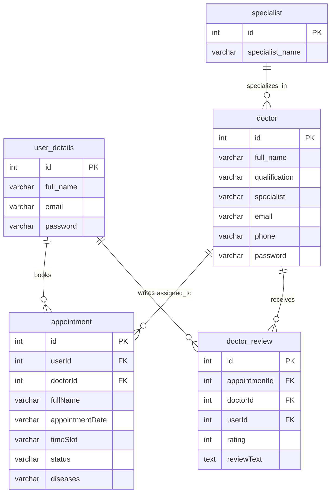

# 🏥 MediPortal — Doctor-Patient Portal

A full-stack **Java Web Application** for managing doctor-patient appointments, built with **Servlets/JSP**, **MySQL**, and deployed on **Apache Tomcat 7**. Features a modern dark glassmorphism UI, real-time booking with time slots, email notifications, doctor ratings, PDF report generation, and an admin analytics dashboard.

---

## 📸 Screenshots

### Patient — View Appointments
> Reschedule, Cancel, Rate, and Download PDF actions

### Admin — Analytics Dashboard
> Chart.js powered doughnut and bar charts with real-time stats

### Homepage — Doctor Cards with Ratings
> Star ratings and review counts displayed on each doctor card

---

## ✨ Features

### 👤 Patient Portal
- **User Registration & Login** — Secure authentication with session management
- **Book Appointments** — Select doctor, date, and 30-minute time slots (9:00 AM – 4:30 PM)
- **Time Slot Conflict Detection** — Prevents double-booking the same doctor at the same time
- **View Appointment History** — See all past and upcoming appointments with status badges
- **Reschedule Appointments** — Change date/time for Pending or Approved appointments via modal
- **Cancel Appointments** — Cancel pending appointments with confirmation
- **Rate & Review Doctors** — Star rating (1-5) and text review after appointment completion
- **Download PDF Reports** — Generate and download professional appointment reports as PDF
- **Change Password** — Update account credentials

### 👨‍⚕️ Doctor Portal
- **Doctor Login** — Separate authentication for doctors
- **View Assigned Patients** — See all appointments assigned by admin
- **Edit Profile** — Update specialization, qualification, and contact details
- **Comment on Appointments** — Add prescriptions and treatment notes

### 🔑 Admin Portal
- **Admin Dashboard** — Real-time analytics with Chart.js:
  - Doughnut chart: Appointments by Status (Pending/Approved/Rejected/Cancelled)
  - Horizontal bar chart: Doctors per Specialization
  - Stat cards: Total Doctors, Patients, Appointments, Specializations
- **Manage Doctors** — Add, edit, view, and delete doctors
- **Manage Appointments** — Approve/reject patient appointments
- **Add Specializations** — Create new medical specialization categories
- **Email Notifications** — Automated HTML emails sent to patients on appointment approval/rejection

---

## 🛠️ Tech Stack

| Layer | Technology |
|-------|-----------|
| **Frontend** | JSP, HTML5, CSS3, JavaScript, Bootstrap 5 |
| **Backend** | Java Servlets, JSP Scriptlets |
| **Database** | MySQL 8+ |
| **Server** | Apache Tomcat 7 (via Maven plugin) |
| **Build Tool** | Apache Maven |
| **Charts** | Chart.js (CDN) |
| **PDF Generation** | iTextPDF 5.5.13.3 |
| **Email** | JavaMail API (javax.mail 1.6.2) |
| **Icons** | Font Awesome 6 |
| **Fonts** | Google Fonts (Poppins, Inter) |

---

## 📁 Project Structure

```
Doctor-Patient-Portal/
├── pom.xml                          # Maven dependencies & build config
├── src/main/
│   ├── java/com/hms/
│   │   ├── admin/servlet/           # Admin servlets
│   │   │   ├── AdminLoginServlet.java
│   │   │   ├── AdminUpdateAppointmentServlet.java
│   │   │   └── ...
│   │   ├── dao/                     # Data Access Objects
│   │   │   ├── AppointmentDAO.java
│   │   │   ├── DoctorDAO.java
│   │   │   └── ReviewDAO.java
│   │   ├── db/
│   │   │   └── DBConnection.java    # MySQL JDBC connection
│   │   ├── doctor/servlet/          # Doctor servlets
│   │   ├── entity/                  # Entity/Model classes
│   │   │   ├── Appointment.java
│   │   │   ├── Doctor.java
│   │   │   ├── Specialist.java
│   │   │   └── User.java
│   │   ├── user/servlet/            # Patient servlets
│   │   │   ├── AppointmentServlet.java
│   │   │   ├── RescheduleAppointmentServlet.java
│   │   │   ├── PatientReportServlet.java
│   │   │   ├── AddReviewServlet.java
│   │   │   └── ...
│   │   └── util/
│   │       └── EmailUtil.java       # SMTP email utility
│   └── webapp/
│       ├── index.jsp                # Homepage with doctor cards
│       ├── user_login.jsp           # Patient login
│       ├── signup.jsp               # Patient registration
│       ├── doctor_login.jsp         # Doctor login
│       ├── admin_login.jsp          # Admin login
│       ├── user_appointment.jsp     # Booking form with time slots
│       ├── view_appointment.jsp     # Appointment history + actions
│       ├── change_password.jsp      # Password change form
│       ├── admin/                   # Admin pages
│       │   ├── index.jsp            # Dashboard with charts
│       │   ├── doctor.jsp           # Add doctor form
│       │   ├── view_doctor.jsp      # Doctor list
│       │   ├── edit_doctor.jsp      # Edit doctor
│       │   └── patient.jsp          # Appointment management
│       ├── doctor/                  # Doctor pages
│       │   ├── index.jsp            # Doctor dashboard
│       │   ├── patient.jsp          # Assigned patients
│       │   └── edit_profile.jsp     # Profile editor
│       ├── component/               # Shared components
│       │   ├── navbar.jsp
│       │   ├── footer.jsp
│       │   └── allcss.jsp           # Design system & CSS variables
│       └── WEB-INF/
│           └── web.xml              # Servlet mappings
```

---

## 🚀 Setup & Installation

### Prerequisites
- **Java JDK 8+** (JDK 17+ recommended)
- **Apache Maven 3.6+**
- **MySQL 8.0+**
- **Git**

### Step 1: Clone the Repository
```bash
git clone https://github.com/your-username/Doctor-Patient-Portal.git
cd Doctor-Patient-Portal
```

### Step 2: Create the Database
Open MySQL and run:
```sql
CREATE DATABASE hospital;
USE hospital;

CREATE TABLE user_details (
    id INT PRIMARY KEY AUTO_INCREMENT,
    full_name VARCHAR(255),
    email VARCHAR(255),
    password VARCHAR(255)
);

CREATE TABLE specialist (
    id INT PRIMARY KEY AUTO_INCREMENT,
    specialist_name VARCHAR(255)
);

CREATE TABLE doctor (
    id INT PRIMARY KEY AUTO_INCREMENT,
    full_name VARCHAR(255),
    dob VARCHAR(255),
    qualification VARCHAR(255),
    specialist VARCHAR(255),
    email VARCHAR(255),
    phone VARCHAR(255),
    password VARCHAR(255)
);

CREATE TABLE appointment (
    id INT PRIMARY KEY AUTO_INCREMENT,
    userId INT,
    fullName VARCHAR(255),
    gender VARCHAR(255),
    age VARCHAR(255),
    appointmentDate VARCHAR(255),
    email VARCHAR(255),
    phone VARCHAR(255),
    diseases VARCHAR(255),
    doctorId INT,
    address VARCHAR(255),
    status VARCHAR(255),
    timeSlot VARCHAR(20)
);

CREATE TABLE doctor_review (
    id INT PRIMARY KEY AUTO_INCREMENT,
    appointmentId INT UNIQUE,
    doctorId INT,
    userId INT,
    rating INT,
    reviewText TEXT,
    createdAt TIMESTAMP DEFAULT CURRENT_TIMESTAMP
);

-- Default admin account
INSERT INTO specialist (specialist_name) VALUES ('Cardiologist');
```

### Step 3: Configure Database Connection
Edit `src/main/java/com/hms/db/DBConnection.java`:
```java
private static final String URL = "jdbc:mysql://localhost:3306/hospital";
private static final String USER = "root";
private static final String PASSWORD = "your_mysql_password";
```

### Step 4: Configure Email (Optional)
Edit `src/main/java/com/hms/util/EmailUtil.java`:
```java
private static final String SENDER_EMAIL = "your_email@gmail.com";
private static final String SENDER_PASSWORD = "your_gmail_app_password";
```
> **Note:** Use a [Gmail App Password](https://support.google.com/accounts/answer/185833), not your regular password.

### Step 5: Build & Run
```bash
mvn clean compile tomcat7:run
```

### Step 6: Access the Application
Open your browser and navigate to:
```
http://localhost:8080/Doctor-Patient-Portal/
```

---

## 🔐 Default Login Credentials

| Role | Email | Password |
|------|-------|----------|
| Admin | `admin@gmail.com` | `admin` |
| Patient | *(Register via Sign Up page)* | — |
| Doctor | *(Added by Admin)* | — |

---

## 📊 Database Schema



---

## 🎨 UI Design System

The application uses a custom **dark glassmorphism** design system with CSS custom properties:

| Token | Value | Usage |
|-------|-------|-------|
| `--navy` | `#0a1628` | Page background |
| `--navy-mid` | `#0f1f35` | Section backgrounds |
| `--navy-card` | `#132238` | Card backgrounds |
| `--primary` | `#00c9b1` | Accent color (teal) |
| `--border-glass` | `rgba(255,255,255,0.06)` | Glass borders |
| `--text-white` | `#e8f0fe` | Primary text |
| `--text-muted` | `#8ca0be` | Secondary text |

---

## 📄 License

This project is for educational purposes.

---

## 🙏 Acknowledgements

- [Bootstrap 5](https://getbootstrap.com/) — Responsive UI framework
- [Chart.js](https://www.chartjs.org/) — Dashboard analytics charts
- [iTextPDF](https://itextpdf.com/) — PDF report generation
- [Font Awesome](https://fontawesome.com/) — Icon library
- [Google Fonts](https://fonts.google.com/) — Poppins & Inter typefaces
